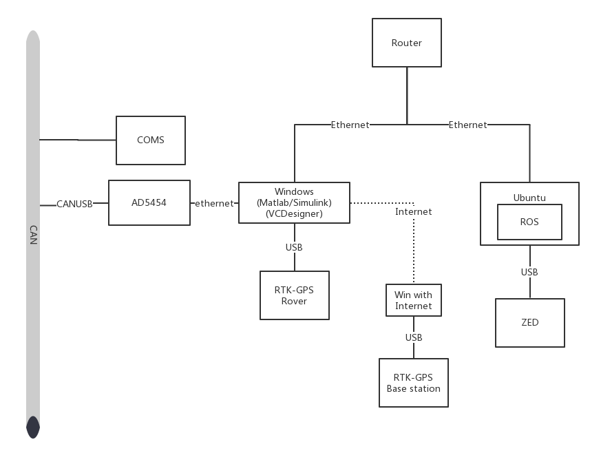
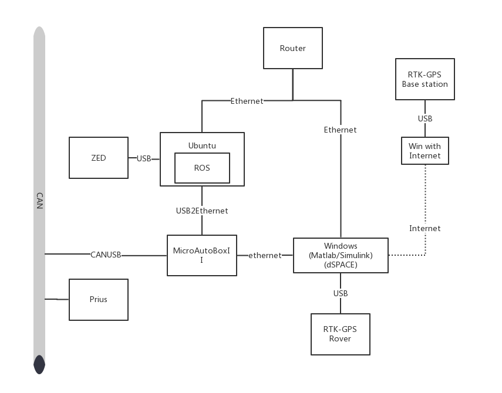

# Car_Robo_Course

## Style
Comprehensive Practicum

##　Period
Intensive course of two-week period (from latter half of August to former half of September)

## Lecturer(s)
Profs. Ogai, Kamata, Inujima, and Tateno (Waseda Univ.)

## Abstract
Students develop autonomous driving systems for small-size EVs (electric vehicles). They also develop control systems for mini-EVs and conduct control simulations using a vehicle simulator. Students use real EVs in the practicum for autonomous driving control, and students take their share of the responsibility for developing techniques including the implementation of sensing devices such as stereo-cameras and laser-range  sensors, and techniques for self-localization, route search, and driving control. On the final day, a competition evaluating their achievements is held in which the developed EVs perform autonomous driving.

日本語 http://jgs.kyutech.ac.jp/car-robo/

English http://jgs.kyutech.ac.jp/car-robo/english/

# Photos 
https://jgs.kyutech.ac.jp/school/results/

## 2021年総合実習コンテストの様子

2021年8月から9月にかけて開催された総合実習4科目の最終日のコンテストの様子です。原則、履修生は現地参加，高専・学部インターンシップ生は遠隔地からのリモート参加としました。

## 2020年総合実習コンテストの様子
自動運転車制御総合実習（オンライン開催）

2020年8月に開催された「自動運転車制御総合実習」（オンライン）の最終日のコンテストの様子です。AUTOWAREを用いたシミュレーションで自動運転タスクを競いました。

＠ホームサービスロボット製作総合実習（対面/オンライン併用開催）

## 2019年総合実習コンテストの様子


2019年9月に開催されたカーロボAI連携大学院「＠ホームサービスロボット製作総合実習」（対面/オンライン併用）の最終日のコンテストの様子です。手法も実装も異なる2チームが0.1秒以下の差で，満点のタスク実行を達成しました。


北九州高専からのインターンシップ生の成果報告の様子です。ロボットハンドの持ち方を替えて，物体を把持することができました。


2019年8月から9月にかけて開催された総合実習3科目の最終日のコンテストの様子です。

カーロボ連携大学院 紹介ムービー 2018年版

## 2018年総合実習コンテストの様子

2018年8月から9月にかけて開催された総合実習5科目の最終日のコンテストの様子です。

## 2017年総合実習コンテストの様子
2017年8月から9月にかけて開催された総合実習5科目の最終日のコンテストの様子です。


総合実習で用いるプリウス自動運転の様子
「自動運転車制御総合実習（旧・小型EV車自動運転制御総合実習）」で2016年度より使用しているプリウスの自動運転の様子です。


## 2016年総合実習コンテストの様子
2016年8月から9月にかけて開催された総合実習6科目の最終日のコンテストの様子です。


## 2015年総合実習コンテストの様子
2015年8月から9月にかけて開催された総合実習6科目の最終日のコンテストの様子です。


## 2014年総合実習コンテストの様子
2014年8月から9月にかけて開催された総合実習6科目の最終日のコンテストの様子です。


画像認識によるロボットアーム制御
＠ホームロボットが画像認識を行いながらアームで物体を把持するデモ動画です。フランスのボルドー工科大から2014年4月から9月にかけて国際インターンシップに来ていたLudovic Hofer君が行った研究の一部です。


ロボカップ＠ホームリーグ出場チーム（九工大）によるサービスロボットのデモ
九工大大学院生命体工学研究科の学生たちが主体となって、ロボカップ＠ホームリーグに向けて活動している「ひびきのムサシ」チームのサービス・ロボット『EXI＠』による音声認識、顔認識、自律移動のデモ動画です。


ロボカップ＠ホームリーグ出場チーム（九工大）によるサービスロボット・アーム制御
サービス・ロボット『EXI＠』による画像認識・アーム制御（対面する人の腕と同じ動きをする）デモ動画です。


小型EV車による自律走行
早稲田大学大学院情報生産システム研究科の大貝研究室が主体となって、FAIS自律走行研究会で開発している小型EV車自律走行のデモ動画です。


北九州学研都市「ひびきのムサシ」チームのロボカップ中型機リーグでの活躍の様子
生命体工学研究科の学生を中心とする「ひびきのムサシ」チームはロボカップ中型機リーグ国内大会で5年連続優勝を果たしており、この自律移動ロボットの技術を本連携大学院の総合実習に活かすことにしています。


『ロボシティ』内を自律移動するミニロボット
九工大大学院生命体工学研究科脳情報専攻で実施した21世紀COEプログラムで開発した、ミニチュア市街地『ロボシティ』内で自律移動するミニロボット『WITH』の走行デモ動画です。


# System Design
## COMS

## Prius



# Program
## 1. ROS
### Obstacle Detection with ZED Camera
`new_detect` rospy package to detect the object.

### GPS Receiver connected with Windows

`tcpcli/scripts/talker.py` to received the GPS signal from Windows RTK GPS by router, because the RTK-GPS now could only run on Windows, and it will broadcast the signal by net, so we could use router to received the information on ROS, then we will transfer it to Simulink.

## 2. Windows

### RTK-GPS

### VCDesigner

### dSPACE AutoBox


# Set Up Tutorial
`start.sh` includes the commands as follows.

```sh
gnome-terminal -e ~/joystick
sleep 10s
gnome-terminal -t "Joystick2coms" -x rosrun joystick2coms dumptest slcan0
sleep 2s
gnome-terminal -t "Joystick2coms" -x rosrun joystick2coms car_position
sleep 2s
gnome-terminal -t "Zed" -x roslaunch zed_wrapper zed.launch
sleep 10s
gnome-terminal -t "OrangLine" -x rosrun beginner_tutorials lane_detection.py
sleep 10s
gnome-terminal -t "detect" -x rosrun side_detect side_cam_detector.py
sleep 10s
gnome-terminal -t "detect" -x rosrun new_detect hello16
gnome-terminal -t "detect" -x python ~/catkin_ws/src/tcpcli/scripts/talker.py
gnome-terminal -t "detect" -x matlab
```
# Set up RTK-GPS rover
[GPS Set Up Japanese Doc](gps.md)

## COMS

1. turn on the power of the COMS at the backend of the car.
1. turn on the ROS computer.
1. turn on the Windows computer.
1. set up the RTK-GPS rover.
1. turn on the AD5454 controller.
1. set up the ROS system.
    ```sh
    source ~/catkin_ws/devel/setup.bash
    ./start.sh
    ```
1. set up the Simulink. 

## Prius


1. turn on the power of the Prius car.
1. turn on the ROS computer.
1. turn on the Windows computer.
1. set up the RTK-GPS rover.
1. turn on the Autobox controller.
1. set up the ROS system.
    ```sh
    source ~/catkin_ws/devel/setup.bash
    ./start.sh
    ```
1. set up the Simulink. 


# Start Autopilot
## COMS
1. turn on the car by the key.
1. when the dashboard is not lighted, turn on the switch of autopilot mode.
## Prius
