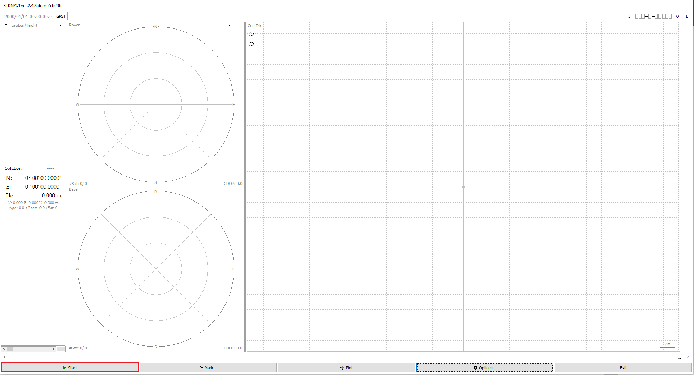

# RTK GNSS使用説明書
## １．原理紹介
GPS測位は衛星からの時間情報を受けるかかる時間によって、三つ方向以上の距離を測って、位置を推算することである。ただし、すべての場所が異なる方向の三つ衛星を見えるわけではないため、色んな衛星システムを通って、見える衛星の数字を増えることになった。
GNSSがアメリカのGPS、中国の「北斗」（BeiDou）、ロシアのGLONASS、欧州連合のGalileoと日本の「準天頂」（QZSS）の総称である。
実際の状況は衛星の電波が届くまで、大気などによって、誤差が出る。RTKがその誤差を削減ためのアルゴリズムである。位置が既知した基準局を誤差ありの位置を推算して、誤差の方向と数値ができた。
## 2.基準局の建て方

まずは、三脚で基準局のアンテナを既知位置で固定する。
受信機がUSBケーブルでパソコンを接続して、基準局のパソコンで「STRSVR」を管理員として開ける。

InputのTypeをSerialに指定して、OutputをNTRIP Serverに指定する。
InputのOptの下の「…」をクリックして

選択できるPortを選択して。COM5とCOM６を選択する場合もあるので、COM1以外のPortを選択すると、「OK」をクリックする。

OutputのOptの下の「…」をクリックして
 

NTRIP Caster Hostで「rtk2go.com」を記入して、Portで「2101」を記入して、Mountpointを覚えやすいの名前を記入する。「OK」をクリックする。
 

「Start」ボタンをクリックすると、基準局の発信が始まる。

## 3.移動局の建て方
まずは、移動局のアンテナを車の上で固定する。
iPhoneのインターネット共有という機能によって、パソコンをインターネットに接続させる。
「設定」>「モバイルデータ通信」の順にタップします。
「インターネット共有」をタップし、スライダをタップしてオンに切り替えます。
＊	インターネット共有のオプションが表示されない場合は、ご加入のプランでインターネット共有を利用できるかどうか、ご契約先の通信事業者にお問い合わせください。
パソコンでiPhoneのインターネット名を選択して、接続する。
受信機がUSBケーブルでパソコンを接続して、基準局のパソコンで「RTKNAVI.exe」を管理員として開ける。

 
右上の「I」ボタンをクリックする。	

 
イメージのように選択する。

 
RoverのOptの下の「…」をクリックする。

 
Portを正確に選択して、「OK」ボタンをクリックする。
 

Base StationのOptの下の「…」をクリックする。
 

NTRIP Caster HostとPortをイメージのように記入する。MountpointをSTRSVRに記入した通り同じ名前を記入する。「OK」ボタンをクリックする。

「Start」をクリックすると、位置情報がWindowsから輸出していく。
 

ROSシステムで、「python tcpcli.py」というコマンドをtcpcli.pyのルートで実行すると、「/pos」というtopicが位置情報を輸出でくる。
